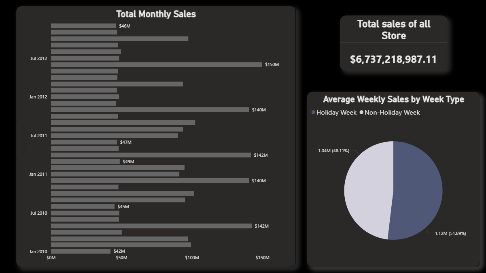
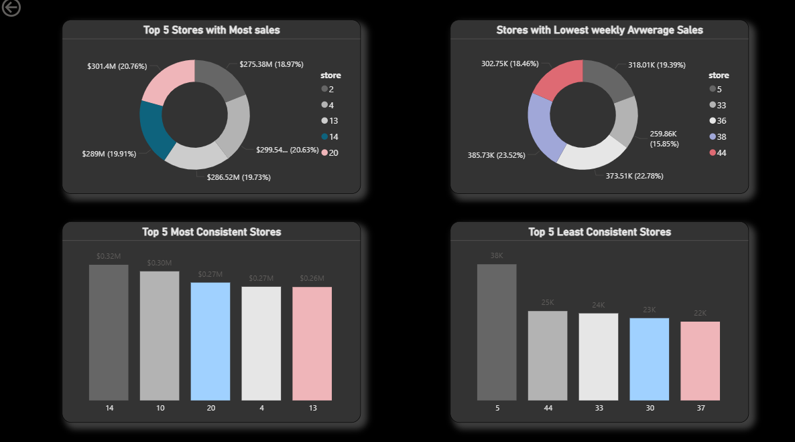
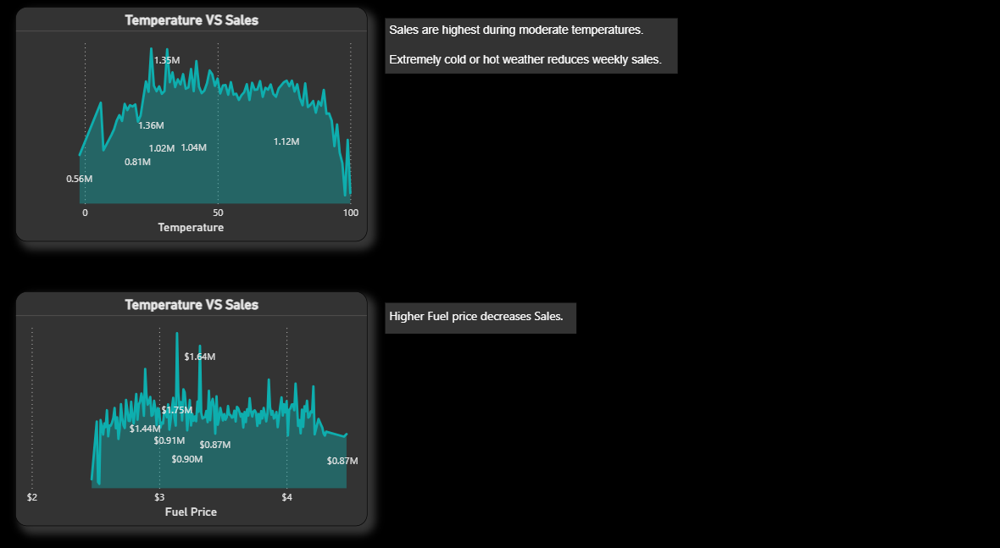

# 📊 Walmart Sales Data Analysis

This project explores Walmart sales performance using Power BI. The dashboard provides deep insights into store-level sales trends, external influences, and performance comparisons.

## 🖼️ Dashboard Preview

### Page 1 – Sales Overview

### Page 2 – Store Performance

### Page 3 – External Factors Impact

## 📁 Project Files
- **Walmart Sales Data.xlsx** – Raw dataset
- **Walmart Dashboard.pbix** – Interactive Power BI dashboard

## ✅ Analysis Overview

### 1. Basic Metrics
- 🔹 Total sales across all stores and weeks
- 🔹 Average weekly sales per store
- 🔹 Total and average sales per individual store

### 2. Sales Trend Over Time
- 🔹 Weekly sales trend (line chart)
- 🔹 Monthly or quarterly aggregated sales overview

### 3. Holiday vs. Non-Holiday Sales
- 🔹 Comparison of average sales during holidays vs. normal weeks
- 🔹 Identification of holidays that significantly affect sales (positive or negative)

### 4. Store Performance Analysis
- 🔹 Top 5 performing stores by total sales
- 🔹 Bottom 5 stores by average weekly sales
- 🔹 Store consistency check through sales volatility

### 5. Impact of External Factors
- 🔹 Correlation between:
  - Temperature and sales
  - Fuel price and sales
  - CPI (Consumer Price Index) and sales
  - Unemployment rate and sales

### 6. Key Insights & Recommendations
- 🔹 Best times for Walmart to run promotions
- 🔹 Stores needing performance improvement
- 🔹 External factors that most impact sales trends

## 🛠 Tools Used
- Microsoft Power BI
- Microsoft Excel
- MySql Workbench

## 📌 Notes
SQL analysis was initially used to extract insights but the queries were lost. All key findings are now presented through the Power BI visuals.
